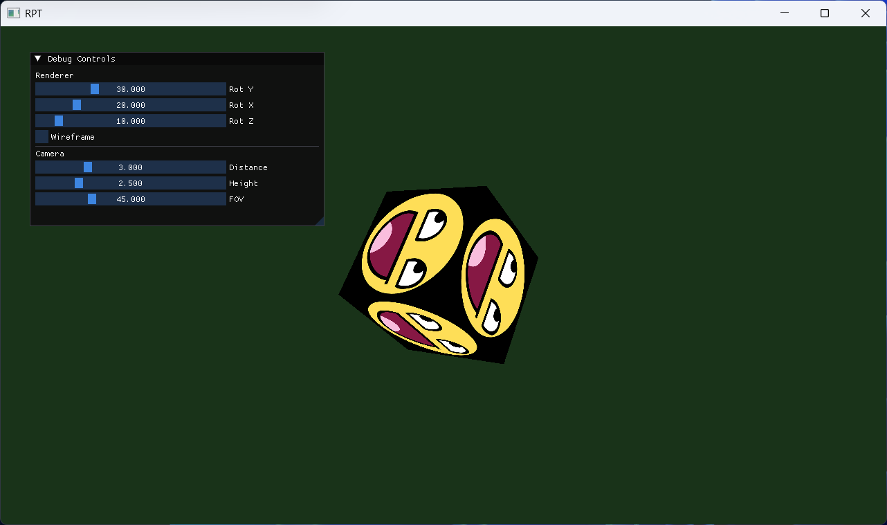

# RPT - 3D OpenGL Renderer

Simple renderer on C++ with OpenGL



> Guess what? its a ***learning, experimental, minimal*** project.

## Whats already done?
- Hardcoded, textured cube
- Rotation on x/y/z axes
- Orbit camera controls
- ImGui debug panel

## Stack
- C++
- GLFW (Window)
- GLAD (OpenGL loader)
- GLM (Math library)
- stb_image (Texture loading)
- Dear ImGui (immediate-mode gui)

## Building
```bash
git clone https://github.com/eteriaal/RPT
cd RPT
cmake -B build
cmake --build build
```
## Running
simply:
```bash
build/RPT # Linux / macOS
build/RPT.exe # Windows
# OR
build/Release/RPT
build/Debug/RPT
# and etc.
```

---
## Planned
- Model loading
- PBR
- ECS
